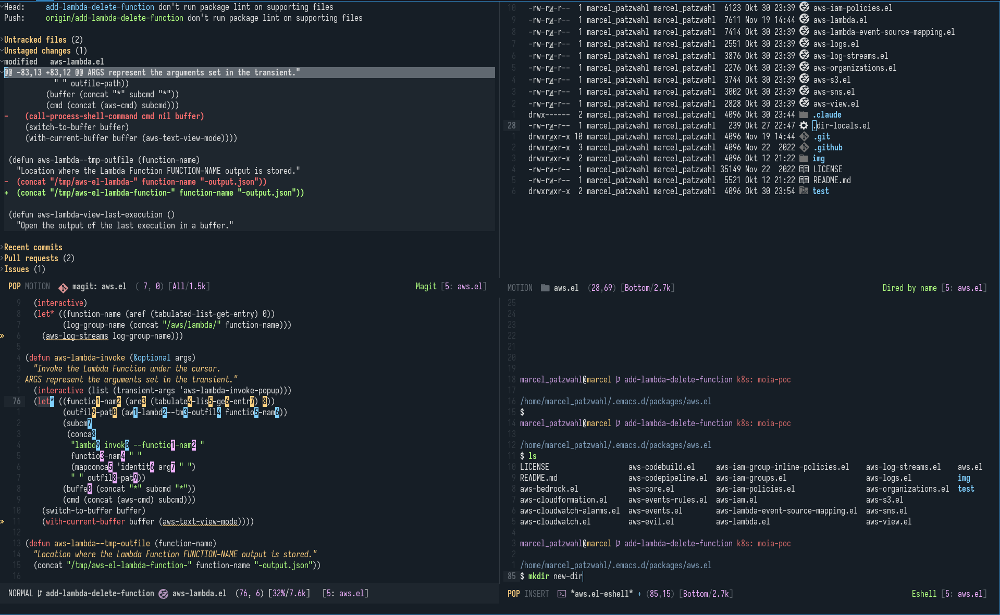

# Acid Theme for Emacs

Acid is a [theme for the Helix Editor](https://github.com/jonathanchu/atom-one-dark-theme) based on [ayu_mirage](https://github.com/vutran1710/Ayu-Theme-Emacs) and [onedark](https://github.com/jonathanchu/atom-one-dark-theme) and made by [@zyrafal](https://github.com/zyrafal).



# How it was created
I tasked claude sonnet 4.5 to take the original helix theme and make an Emacs Theme out of it. I personally don't have any experience in making themes, especially for Emacs. But I have to say I'm quite happy with the result that claude put out. The only thing I changed afterwards were the numbered highlights in mewo modal mode, which were too dark by default. Also this theme currently only supports modes I personally use. If you want the theme for further modes, let me know or create a PR.

# Installation

## Manual
Create a directory for themes somewhere, if you don't have it yet. For example `~/.emacs.d/themes` and put the acid theme file from this repository in that directory. Then add the following to your `init.el`:

```emacs-lisp
(add-to-list 'custom-theme-load-path "~/.emacs.d/themes")
(load-theme 'acid t)
```


